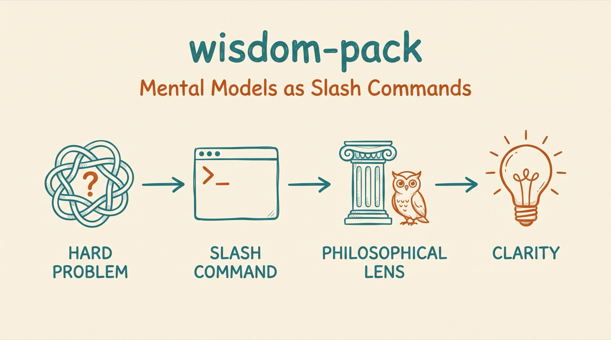

# Wisdom Pack

*Philosophy-grounded thinking frameworks for Claude Code.*




> *"Think better with 2,500 years of tested frameworks"*

wisdom-pack provides slash commands that connect to actual philosophical traditions with wisdom sourced from classic and modern texts.

## Why

Unlike generic mental models, each command draws from specific thinkers and frameworks.

## Install

```bash
# In Claude Code:
/plugin marketplace add aplaceforallmystuff/marketplace
/plugin install wisdom-pack@jim-christian
```

<details>
<summary>Manual install (without the marketplace)</summary>

```bash
git clone https://github.com/aplaceforallmystuff/wisdom-pack.git
cd wisdom-pack
./install.sh
```
</details>

## Use cases

- Use it when you're anxious about an outcome and need to separate what you control from what you don't — `/wisdom-stoic-dichotomy`.
- Use it when you're making a big decision and want to check your reasoning for cognitive biases — `/wisdom-cognitive-bias-scan`.
- Use it when you feel rushed or reactive and need space before you respond — `/wisdom-mindful-pause`.
- Use it when you're worried about failure and want to prepare mentally for the worst case — `/wisdom-stoic-premeditation`.
- Use it when you're timing a major move and need to judge whether now is the right time — `/wisdom-strategic-timing`.
- Use it when you're facing a complex challenge and aren't sure which framework fits — `/wisdom-ground`.

## How it works

Each command loads one philosophical framework and applies it to the situation you pass in. It runs a defined process from that tradition, quotes the relevant primary sources, and returns structured guidance. `/wisdom-ground` auto-selects the framework that best fits your situation; `/wisdom-clarify` runs Socratic questioning to define terms and examine assumptions.

## Commands

### Stoic Framework

| Command | Purpose | Key Question |
|---------|---------|--------------|
| `/wisdom-stoic-dichotomy` | Separate what's in your control | "What here is up to me?" |
| `/wisdom-stoic-premeditation` | Visualize worst case scenarios | "What if this fails completely?" |
| `/wisdom-stoic-memento-mori` | Mortality perspective | "Would this matter on my deathbed?" |

**Sources:** Epictetus, Marcus Aurelius, Seneca, Massimo Pigliucci

### Cognitive Framework

| Command | Purpose | Key Question |
|---------|---------|--------------|
| `/wisdom-cognitive-bias-scan` | Detect cognitive biases | "What biases might be operating?" |

**Sources:** Daniel Kahneman, Malcolm Gladwell, Amos Tversky

### Mindfulness Framework

| Command | Purpose | Key Question |
|---------|---------|--------------|
| `/wisdom-mindful-pause` | Create space before reacting | "What do I notice right now?" |

**Sources:** Thich Nhat Hanh, Viktor Frankl, Jon Kabat-Zinn

### Strategic Framework

| Command | Purpose | Key Question |
|---------|---------|--------------|
| `/wisdom-strategic-timing` | Assess readiness for action | "Is this the right time?" |
| `/wisdom-strategic-five-rings` | Apply Musashi's five elements | "Which ring needs attention?" |

**Sources:** Miyamoto Musashi (Book of Five Rings)

### Meta Commands

| Command | Purpose |
|---------|---------|
| `/wisdom-clarify` | Socratic questioning - define terms, examine assumptions |
| `/wisdom-ground` | Auto-select relevant framework for any situation |

### Quick Reference

| Situation | Command |
|-----------|---------|
| Anxious about outcomes | `/wisdom-stoic-dichotomy` |
| Making a big decision | `/wisdom-cognitive-bias-scan` |
| Feeling rushed/reactive | `/wisdom-mindful-pause` |
| Need perspective | `/wisdom-stoic-memento-mori` |
| Worried about failure | `/wisdom-stoic-premeditation` |
| Timing a major move | `/wisdom-strategic-timing` |
| Complex challenge | `/wisdom-strategic-five-rings` |
| Unclear thinking | `/wisdom-clarify` |
| Not sure which framework | `/wisdom-ground` |

## Example

Invoke a command with your situation as the argument:

```
/wisdom-stoic-dichotomy I'm anxious about whether a client will accept my proposal
```

Illustrative response:

```
Within Your Control:
- The quality and clarity of the proposal
- Following up professionally
- Your response if they decline

Outside Your Control:
- The client's final decision → Instead, focus on: making the strongest case you can
- Their budget and internal politics → Instead, focus on: what you offer regardless

Stoic Guidance:
Direct your energy to the proposal itself and your conduct. Treat the outcome
as a preferred indifferent - work toward it, stay unattached to the result.
```

## Sources

Each command draws from primary philosophical sources:

- **Stoicism:** Epictetus, Marcus Aurelius, Seneca
- **Cognitive Science:** Daniel Kahneman, Amos Tversky
- **Mindfulness:** Thich Nhat Hanh, Viktor Frankl
- **Strategic:** Miyamoto Musashi (Book of Five Rings)
- **Socratic:** Socrates, Plato

## Related

- [mcp-wisdom](https://github.com/aplaceforallmystuff/mcp-wisdom) - MCP server version for Claude Desktop

## Changelog

See [CHANGELOG.md](CHANGELOG.md) for a history of changes to this project.

## Links

- [GitHub repository](https://github.com/aplaceforallmystuff/wisdom-pack)
- [Report issues](https://github.com/aplaceforallmystuff/wisdom-pack/issues)

## License

MIT — see [LICENSE](LICENSE).
